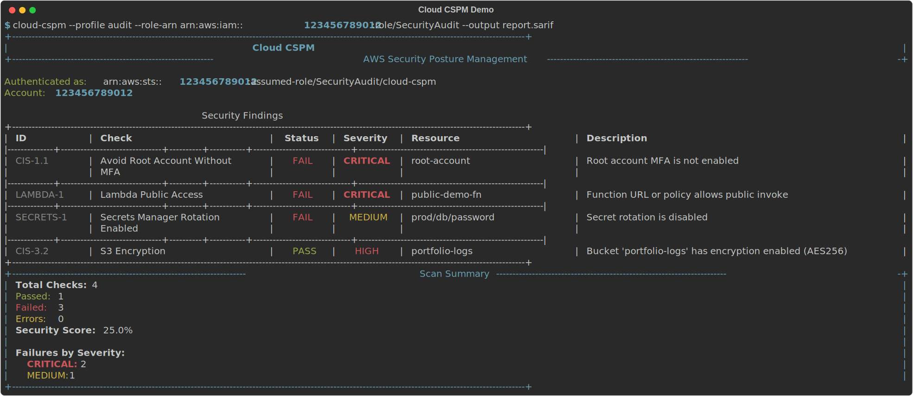

# Cloud CSPM


Cloud CSPM is a lightweight AWS Cloud Security Posture Management CLI that scans
for CIS-style security misconfigurations across IAM, S3, EC2, RDS, logging,
Lambda, and Secrets Manager. It supports cross-account scanning with STS
AssumeRole, uses `boto3`, `click`, and `rich`, and includes modern Python
project metadata, CI workflows, and native SARIF export.


## What It Scans

| Scanner | Checks |
|---------|--------|
| IAM | Root MFA, password policy, unused credentials, key rotation, console user MFA |
| S3 | Public access blocks, encryption, versioning, access logging, SSL enforcement |
| EC2 | Open SSH/RDP, dangerous ports, default security groups, EBS encryption, public instances |
| RDS | Encryption, public access, Multi-AZ, auto upgrades, backup retention, deletion protection |
| Logging | CloudTrail enabled, log validation, KMS encryption, VPC flow logs |
| Lambda | Public access, environment KMS encryption, VPC attachment, multi-AZ subnets, tags, X-Ray tracing |
| Secrets Manager | Rotation enabled, recent rotation, recent access, tags |

## Requirements

- Python 3.11 to 3.14
- AWS credentials configured with `aws configure` or environment variables
- Read-only AWS access such as the `SecurityAudit` managed policy
- `sts:AssumeRole` permission if you want to scan a different AWS account

## Quick Start

Preferred workflow with `uv`:

```bash
git clone https://github.com/Prakashgode/cloud-cspm.git
cd cloud-cspm
uv sync --locked --all-extras --dev
uv run cloud-cspm
```

Fallback with `pip`:

```bash
python -m venv .venv
# Linux/macOS: source .venv/bin/activate
# Windows PowerShell: .venv\Scripts\Activate.ps1
pip install -e ".[dev]"
cloud-cspm
```

You can still run the source entry point directly with `python cspm.py`.

## Usage

```bash
# run everything
cloud-cspm

# specific profile
cloud-cspm --profile production

# single region
cloud-cspm --region us-east-1

# specific scanners
cloud-cspm --scanner iam --scanner s3
cloud-cspm --scanner lambda --scanner secrets

# filter by severity
cloud-cspm --severity CRITICAL

# export results
cloud-cspm --output report.json
cloud-cspm --output report.csv
cloud-cspm --output report.sarif
```

## Sample Reports

Sample artifacts are committed under:

- [`samples/demo-report.json`](samples/demo-report.json)
- [`samples/demo-report.csv`](samples/demo-report.csv)
- [`samples/demo-report.sarif`](samples/demo-report.sarif)

The SARIF artifact contains actionable `FAIL` and `ERROR` findings only, which
is useful for machine processing and downstream security tooling.

This SARIF export models findings against AWS resource URIs, not repository
files. It is intended as a generic interchange format for cloud-security
pipelines, not as a GitHub code-scanning upload format.

Regenerate the demo assets locally with:

```bash
uv run python scripts/generate_sample_artifacts.py
```



## Cross-Account Scanning

Use STS AssumeRole to scan a different AWS account with the same CLI:

```bash
cloud-cspm \
  --profile security-audit \
  --role-arn arn:aws:iam::123456789012:role/SecurityAudit
```

If the target role requires an external ID:

```bash
cloud-cspm \
  --profile security-audit \
  --role-arn arn:aws:iam::123456789012:role/SecurityAudit \
  --external-id cspm-demo
```

## Development

Install the full developer environment:

```bash
uv sync --locked --all-extras --dev
```

Run the quality gates locally:

```bash
uv run ruff format .
uv run ruff check .
uv run mypy
uv run pytest -v
```

The repo includes:

- `pyproject.toml` for project metadata and tool configuration
- `uv.lock` for reproducible dependency resolution
- Ruff for linting and import sorting
- mypy for basic type checking
- GitHub Actions matrix testing on Python 3.11 to 3.14
- Dependabot for pip and GitHub Actions updates
- Dependency Review on pull requests
- Native SARIF export for downstream security tooling
- moto-backed integration tests for AWS emulator coverage
- `SECURITY.md`, `LICENSE`, and `CONTRIBUTING.md` for repo hygiene

## Project Layout

```text
cloud-cspm/
|-- assets/
|-- cspm.py
|-- samples/
|-- scripts/
|-- pyproject.toml
|-- uv.lock
|-- scanners/
|-- reports/
|-- policies/
|-- tests/
`-- .github/workflows/
```

## Adding a Scanner

Extend `BaseScanner` and call `self.add_finding(...)`:

```python
from scanners.base_scanner import BaseScanner, Severity, Status


class MyScanner(BaseScanner):
    def scan(self):
        self.add_finding(
            check_id="CUSTOM-1",
            check_name="My Check",
            status=Status.FAIL,
            severity=Severity.HIGH,
            resource_id="resource-123",
            resource_type="AWS::Service::Resource",
            region="us-east-1",
            description="Description of the finding",
            remediation="How to fix it",
        )
        return self.findings
```

## License

MIT

